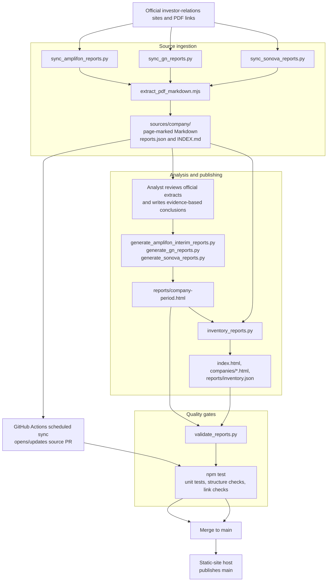

# Architecture

Investor Reports is a static publishing pipeline with two distinct layers:

1. **Source ingestion** finds official company materials and produces
   traceable, page-marked Markdown.
2. **Analysis publishing** turns reviewed investor conclusions into HTML
   briefs and company dashboards.

The source-sync layer is automated in GitHub Actions. The analysis layer is
currently human-authored: a new source document does not automatically create
or publish an investor brief.

## Data flow



## Script responsibilities

| Script | Input | Output | Purpose |
| --- | --- | --- | --- |
| `sync_amplifon_reports.py` | Amplifon financial-report and presentation indexes | Amplifon extracts, manifest, and source index | Discovers, validates, checksums, and extracts supported Amplifon PDFs. |
| `sync_gn_reports.py` | GN download-center API; shared engine for Sonova | GN or Sonova extracts, manifest, and source index | Discovers supported documents, prevents duplicate/replacement downloads, and coordinates extraction. |
| `sync_sonova_reports.py` | Sonova configuration | Sonova extracts, manifest, and source index | Configures the shared GN/Sonova sync engine for Sonova paths and files. |
| `extract_pdf_markdown.mjs` | Temporary verified PDF | Page-marked Markdown body | Uses PDF.js to turn a PDF into source text that can be cited by page. |
| `generate_amplifon_interim_reports.py` | Authored Amplifon analysis definitions and source references | Amplifon HTML briefs | Renders the defined interim investor briefs. |
| `generate_gn_reports.py` | Authored GN analysis definitions and source references | GN HTML briefs | Renders the defined GN investor briefs. |
| `generate_sonova_reports.py` | Authored Sonova analysis definitions and source references | Sonova HTML briefs | Renders the defined Sonova investor briefs. |
| `inventory_reports.py` | Source manifests and valid HTML briefs | `index.html`, `companies/*.html`, `reports/inventory.json` | Marks periods as analyzed or pending and rebuilds reader-facing dashboards. |
| `validate_reports.py` | HTML briefs, dashboards, and links | Exit status and validation messages | Enforces report structure and local-link integrity. |

## Source-sync lifecycle

Each company sync follows the same safety model:

1. Fetch configured official indexes or endpoints.
2. Classify only supported report types for that company.
3. Accept only official-domain PDF URLs on allowed paths.
4. Skip known URLs and avoid overwriting an existing period/type combination.
5. Verify the PDF signature and minimum size.
6. Record URL, date, byte size, and SHA-256 checksum in `reports.json`.
7. Convert the temporary PDF to Markdown with page markers.
8. Regenerate the company `INDEX.md`.

Scheduled Actions run this lifecycle on the 10th and 25th of each month and
open a source-update pull request when tracked files change. See
[Scheduled Source Syncs](docs/scheduled-source-syncs.md).

## Publishing lifecycle

To publish a newly available reporting period today:

1. Merge the source-sync PR so the extracted official materials are on `main`.
2. Review those extracts and author the investor analysis, including source
   references and caveats.
3. Add the period to the relevant `generate_*_reports.py` script, then run it
   to produce `reports/<company>-<period>.html`.
4. Run `python3 scripts/inventory_reports.py` to expose the brief in the
   company dashboard and top-level directory.
5. Run `npm test`, review the generated HTML, and merge the publishing PR.

The static-site provider can publish the merged files, but no repository
workflow currently invokes the generators or `inventory_reports.py` after a
source sync. This separation prevents an unreviewed source document from
becoming an automatically published investment analysis.

## Useful commands

```bash
# Source discovery and extraction
python3 scripts/sync_amplifon_reports.py
python3 scripts/sync_gn_reports.py
python3 scripts/sync_sonova_reports.py

# Render already-authored briefs and refresh dashboards
python3 scripts/generate_amplifon_interim_reports.py
python3 scripts/generate_gn_reports.py
python3 scripts/generate_sonova_reports.py
python3 scripts/inventory_reports.py

# Validate the repository's published surface
npm test
```
